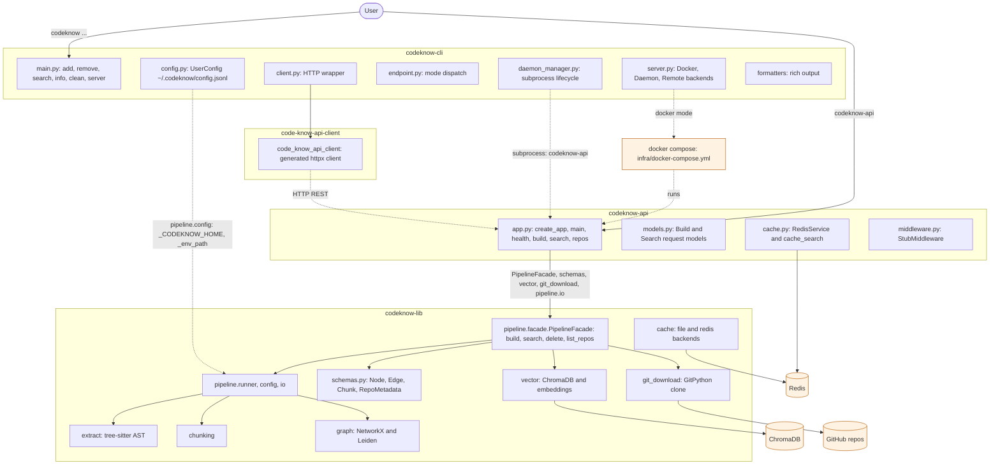

# CodeKnow

Turn any GitHub repo into a LOCAL searchable **code knowledge graph**. CodeKnow indexes source code into a graph of entities and relationships, then answers natural-language queries with **hybrid search** — vector similarity expanded by graph traversal — so you find code by meaning *and* by structure.

## What is CodeKnow?

CodeKnow is a self-hosted (not token cost, just docker) code intelligence stack that indexes repositories into a per-repo knowledge graph and serves grounded, navigable search over them.

- **Hybrid search** — every query runs through vector similarity *and* a weighted BFS over the knowledge graph (edges like `calls`, `inherits`, `uses`, `semantically_similar_to`), then merges the two.
- **Three components** — `codeknow-lib` (the indexing + search pipeline), `codeknow-api` (FastAPI server), `codeknow-cli` (user-facing CLI).
- **Three run modes** — `docker` (CLI drives the full Compose stack, default), `remote` (point at any shared API), `daemon` (CLI manages a local `codeknow-api` process).
- **Multi-repo** — index many repos at once and search across all of them, or scope a query to specific slugs.
- **Incremental updates** — update an indexed repo from its tracked remote. Unchanged file parsing and embeddings are reused.

## Why does it exist?

Plain keyword and ripgrep search find *where a string appears*, but miss the relationships that make code understandable — which function calls which, what inherits from what, what a chunk is semantically *about*. When an LLM agent (or a human) needs to answer "how does auth work?", keyword hits alone leave it ungrounded: it sees the word `auth` everywhere but not the flow.

CodeKnow closes that gap by combining two signals that keyword tools can't:

1. **Semantic similarity** (vector embeddings) — finds code that means the same thing even with different names.
2. **Structural connectivity** (the knowledge graph) — walks the real call/inherit/use edges so answers stay grounded in how the code actually fits together.

The eval in [`evals/README.md`](evals/README.md) measures exactly this: identical agents, identical prompts, only the search tool differs — CodeKnow's hybrid search vs. plain ripgrep — scored by a multi-stage LLM judge.

## How it works

At a high level, two flows:

- **Indexing** runs each repo through a 7-stage pipeline: clone or update → detect source files (tree-sitter) → extract AST → build the knowledge graph → map overlapping text chunks onto graph nodes → cluster communities → embed chunks into ChromaDB. Incremental updates parse and embed only changed files, then rebuild the graph from all cached extractions. Each repo gets its own graph (`~/.codeknow/graph/<slug>/`) and generation-specific Chroma collections.
- **Searching** runs 3 stages: embed the query and match chunk embeddings (vector) → map hits back to graph nodes and expand via weighted BFS (graph) → merge and rank by provenance + relevance. Backed by ChromaDB (vectors), Redis (response cache), and Docker Model Runner (local embeddings).

Details in [How search works](#how-search-works) below.

## System diagram



Full legend and per-node detail in [`docs/system-diagram.md`](docs/system-diagram.md).

## Quick start

The CLI defaults to `docker` mode, which drives the full Compose stack (API + ChromaDB + Redis + embeddings) on `localhost:8080` — nothing to configure.

```bash
# 1. Start the full stack from the repo root
codeknow server start

# 2. Add or update a repo
codeknow add git@github.com:owner/repo.git

# 3. Search
codeknow search "how does auth work"

# 4. Stop the stack
codeknow server stop
```

To run the API as a local `codeknow-api` process the CLI manages, switch modes with `codeknow server mode daemon` (or `remote` to point at any other API). See [docs/usage.md](docs/usage.md).

## How search works

CodeKnow uses **hybrid search** — vector similarity expanded by a knowledge graph — to find relevant code across one or more indexed repositories.

### Indexing

When you run `codeknow add`, the pipeline processes the repo through seven stages:

1. **Resolve** — clone or locate the repository locally
2. **Detect** — discover source files using tree-sitter
3. **Extract AST** — parse files into an abstract syntax tree
4. **Build graph** — construct a knowledge graph where nodes are code entities (functions, classes, modules) and edges represent relationships (`imports`, `calls`, `inherits`, `uses`, etc.)
5. **Map chunks** — split source files into overlapping text chunks and link each graph node to its overlapping chunks
6. **Cluster** — detect communities of tightly-connected nodes
7. **Embed** — generate vector embeddings for each chunk and store them in ChromaDB

Each indexed repo gets its own graph (`~/.codeknow/graph/<slug>/`) and its own ChromaDB collection.

### Searching

1. **Vector search** — the query is embedded and matched against chunk embeddings in ChromaDB, returning the closest code snippets
2. **Graph expansion** — matched chunks are mapped back to graph nodes via a reverse index. A weighted BFS traversal expands from these seed nodes, following edges like `calls` (0.7), `inherits` (0.8), and `semantically_similar_to` (1.0) — stronger relations carry more weight
3. **Hybrid merge** — additional chunks discovered through graph traversal are fetched from ChromaDB and merged with the original vector results, then sorted by provenance (vector hits first) and relevance

### Multi-repo search

Multiple repos can be indexed and searched simultaneously. `multi_search` queries each repo's graph and vector store in parallel, then merges and ranks results across all repos. Use `--slug` to scope a search to specific repos:

```bash
codeknow search "database connection" --slug owner-repo --slug other-repo
```

## Commands

| Command | Description |
|---|---|
| `codeknow add <ssh-url>` | Index a GitHub repo |
| `codeknow reindex <slug>` | Fetch and incrementally update an indexed repo |
| `codeknow rebuild <slug>` | Fully rebuild an indexed repo |
| `codeknow remove <slug>` | Remove an indexed repo |
| `codeknow search <query>` | Search the knowledge graph |
| `codeknow info` | Show API status and indexed repos |
| `codeknow clean` | Remove cached repos, graph output, and temp files |
| `codeknow server <subcommand>` | Manage the API server: `mode` (`docker` \| `remote` \| `daemon`), `start`, `stop`, `status` |

The CLI resolves its endpoint from the `mode` field in `~/.codeknow/config.jsonl`. The default mode is `docker`, which connects to the Docker stack at `localhost:8080`. Switch to `daemon` (CLI manages a local `codeknow-api` process) or `remote` (any other API URL) with `codeknow server mode <mode>`. See [docs/usage.md](docs/usage.md).

`codeknow add` fetches the tracked remote when the repo is already indexed and performs an incremental update. Use `codeknow reindex <slug>` to update an existing repo, `--no-fetch` to use its cached checkout, or `codeknow rebuild <slug>` to force a full rebuild.

Builds are published atomically. Search continues to use the last complete generation until the new generation passes validation. A failed update leaves the active index unchanged.

## API server

```bash
codeknow-api                    # production
codeknow-api --debug            # auto-reload + debug logging
```

| Flag | Default | Env var |
|---|---|---|
| `--host` | `127.0.0.1` | `CODEKNOW_API_HOST` |
| `--port` | `8080` | `CODEKNOW_API_PORT` |
| `--debug` | off | — |

## Package structure

```
packages/
  codeknow-lib/     Core library — knowledge graph pipeline, tree-sitter parsing, embeddings
  codeknow-api/     FastAPI server
  codeknow-cli/     User-facing CLI client
```

## Configuration

The CLI is **config-file driven**, not environment-variable driven. It reads a single-line JSON object from `~/.codeknow/config.jsonl`:

```json
{"mode":"docker","remote_url":"","host":"localhost","port":8080}
```

- `mode` — `docker` (default), `remote`, or `daemon`. Switch with `codeknow server mode <mode>`.
- `remote_url` — used only in `remote` mode.
- `host` / `port` — used only in `daemon` mode.

See [docs/usage.md](docs/usage.md) for the full reference. (The `codeknow-api` server itself still reads `CODEKNOW_API_HOST` / `CODEKNOW_API_PORT` — see the table above.)

## Documentation

| Link | What it covers |
|---|---|
| [docs/SetUp.md](docs/SetUp.md) | Development setup from source — `uv sync`, running tests, `dev-check` (ruff + pyrefly), bringing up infra |
| [docs/install.md](docs/install.md) | Installing CodeKnow as a global tool / dependency; global install, remote mode, and troubleshooting |
| [docs/infra-setup.md](docs/infra-setup.md) | Bringing up the backing services — ChromaDB, Redis, Docker Model Runner; full-stack Docker Compose; troubleshooting |
| [docs/usage.md](docs/usage.md) | Full CLI command reference — the three modes (`docker` / `remote` / `daemon`), the `server` group, config-file format, running `codeknow-api` directly |
| [docs/system-diagram.md](docs/system-diagram.md) | Full architecture diagram with legend — CLI, API, lib, and external services |
| [evals/README.md](evals/README.md) | Hybrid (CodeKnow) vs. grep (ripgrep) eval on the Fastify codebase, scored by a 3-stage LLM judge on grounding and faithfulness |
