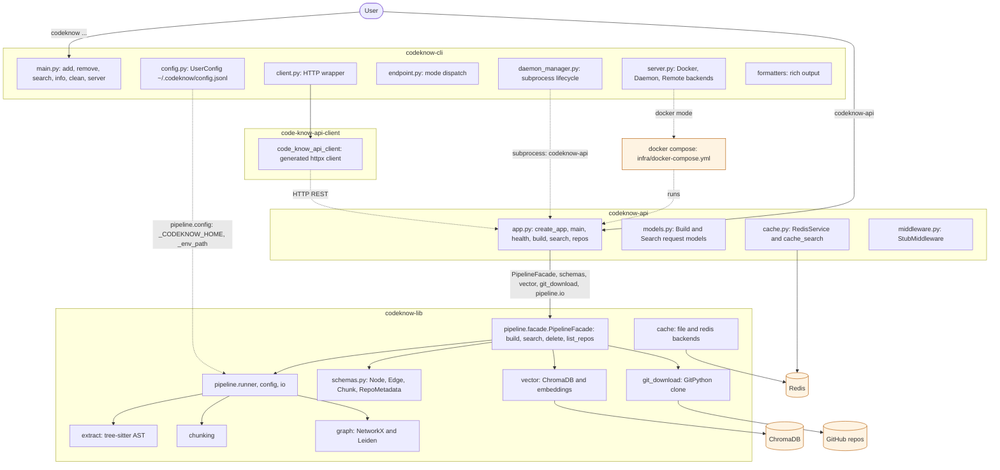

```mermaid
flowchart TB
    User([User])

    subgraph CLI[codeknow-cli]
        direction TB
        CLI_main[main.py: add, remove, search, info, clean, server]
        CLI_client[client.py: HTTP wrapper]
        CLI_config[config.py: UserConfig ~/.codeknow/config.jsonl]
        CLI_endpoint[endpoint.py: mode dispatch]
        CLI_server[server.py: Docker, Daemon, Remote backends]
        CLI_daemon[daemon_manager.py: subprocess lifecycle]
        CLI_formatters[formatters: rich output]
    end

    subgraph GEN[code-know-api-client]
        GEN_client[code_know_api_client: generated httpx client]
    end

    subgraph API[codeknow-api]
        direction TB
        API_app[app.py: create_app, main, health, build, search, repos]
        API_models[models.py: Build and Search request models]
        API_cache[cache.py: RedisService and cache_search]
        API_mw[middleware.py: StubMiddleware]
    end

    subgraph LIB[codeknow-lib]
        direction TB
        LIB_facade[pipeline.facade.PipelineFacade: build, search, delete, list_repos]
        LIB_pipeline[pipeline.runner, config, io]
        LIB_schemas[schemas.py: Node, Edge, Chunk, RepoMetadata]
        LIB_extract[extract: tree-sitter AST]
        LIB_chunk[chunking]
        LIB_graph[graph: NetworkX and Leiden]
        LIB_vector[vector: ChromaDB and embeddings]
        LIB_git[git_download: GitPython clone]
        LIB_cache[cache: file and redis backends]
    end

    Redis[(Redis)]
    Chroma[(ChromaDB)]
    GitHub[(GitHub repos)]
    Docker[docker compose: infra/docker-compose.yml]

    CLI_client --> GEN_client
    CLI_config -.->|pipeline.config: _CODEKNOW_HOME, _env_path| LIB_pipeline
    API_app -->|PipelineFacade, schemas, vector, git_download, pipeline.io| LIB_facade
    LIB_facade --> LIB_pipeline
    LIB_facade --> LIB_vector
    LIB_facade --> LIB_git
    LIB_facade --> LIB_schemas
    LIB_pipeline --> LIB_extract
    LIB_pipeline --> LIB_chunk
    LIB_pipeline --> LIB_graph

    LIB_git --> GitHub
    LIB_vector --> Chroma
    LIB_cache --> Redis
    API_cache --> Redis

    GEN_client -. HTTP REST .-> API_app
    CLI_daemon -. subprocess: codeknow-api .-> API_app
    CLI_server -. docker mode .-> Docker
    Docker -. runs .-> API_app

    User -->|codeknow ...| CLI_main
    User -->|codeknow-api| API_app

    classDef ext fill:#fef3e2,stroke:#b35900,stroke-width:1px
    class Redis,Chroma,GitHub,Docker ext
```